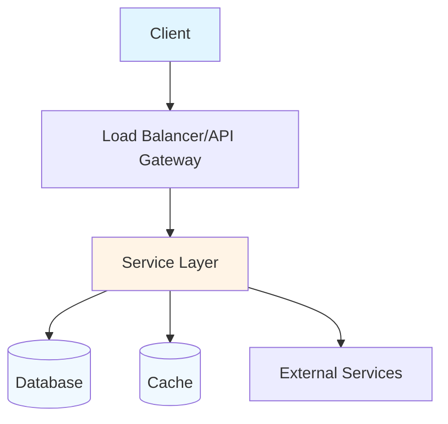
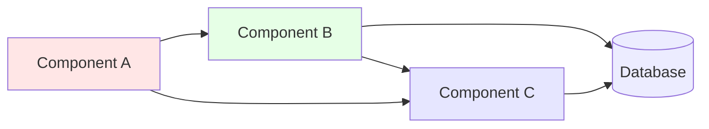
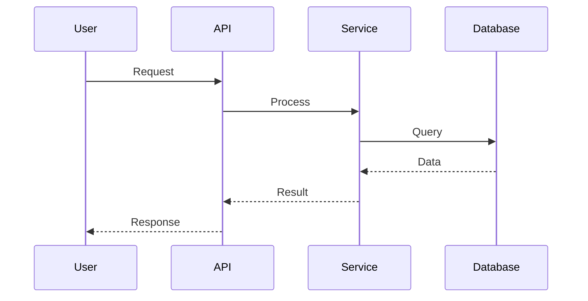
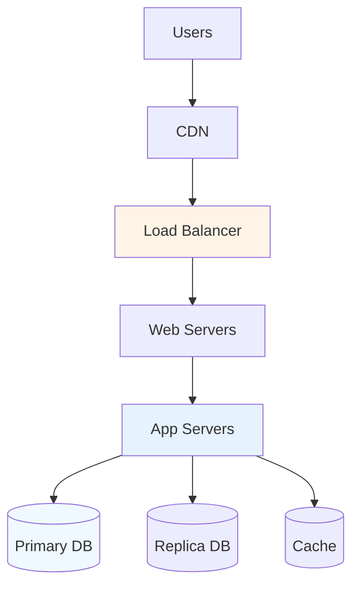

# Architecture - {{PROJECT_NAME}}

**Last Updated:** {{DATE}}

## Table of Contents

- [Overview](#overview)
- [System Architecture](#system-architecture)
- [Architectural Patterns](#architectural-patterns)
- [Technology Choices](#technology-choices)
- [Component Relationships](#component-relationships)
- [Data Flow](#data-flow)
- [Deployment Architecture](#deployment-architecture)
- [Scalability](#scalability)

## Overview

{{PROJECT_NAME}} uses a {{ARCHITECTURE_PATTERN}} architecture to {{PRIMARY_GOAL}}.

**Key Architectural Characteristics:**
- {{CHARACTERISTIC_1}}
- {{CHARACTERISTIC_2}}
- {{CHARACTERISTIC_3}}

## System Architecture

### High-Level Architecture



### Architecture Layers

```
{{LAYERED_DIAGRAM}}
```

**Layer Descriptions:**

#### {{LAYER_1}}
- **Purpose:** {{PURPOSE}}
- **Components:** {{COMPONENTS}}
- **Technologies:** {{TECHNOLOGIES}}

#### {{LAYER_2}}
- **Purpose:** {{PURPOSE}}
- **Components:** {{COMPONENTS}}
- **Technologies:** {{TECHNOLOGIES}}

## Architectural Patterns

### {{PATTERN_NAME}}

**Description:** {{PATTERN_DESCRIPTION}}

**Implementation:**
```mermaid
{{PATTERN_DIAGRAM}}
```

**Rationale:** {{RATIONALE}}

### Other Patterns

- {{PATTERN_1}}: {{USAGE}}
- {{PATTERN_2}}: {{USAGE}}
- {{PATTERN_3}}: {{USAGE}}

## Technology Choices

### {{TECHNOLOGY_CHOICE}}

**Selected:** {{SELECTED_TECH}}

**Alternatives Considered:**
- {{ALT_1}}: {{WHY_NOT}}
- {{ALT_2}}: {{WHY_NOT}}

**Rationale:** {{RATIONALE}}

### Other Choices

| Component | Technology | Why |
|-----------|-----------|-----|
| {{COMP_1}} | {{TECH_1}} | {{REASON_1}} |
| {{COMP_2}} | {{TECH_2}} | {{REASON_2}} |
| {{COMP_3}} | {{TECH_3}} | {{REASON_3}} |

## Component Relationships

### Component Map



### Key Dependencies

**{{COMPONENT_A}} depends on:**
- {{DEPENDENCY_1}}
- {{DEPENDENCY_2}}

**{{COMPONENT_B}} is used by:**
- {{DEPENDENT_1}}
- {{DEPENDENT_2}}

See [COMPONENTS.md](COMPONENTS.md) for detailed component documentation.

## Data Flow

### User Request Flow



### Data Flow Description

1. **Request Reception:** {{STEP_1}}
2. **Validation:** {{STEP_2}}
3. **Processing:** {{STEP_3}}
4. **Data Access:** {{STEP_4}}
5. **Response:** {{STEP_5}}

See [DATA-MODELS.md](DATA-MODELS.md) for data schema details.

## Deployment Architecture

### Development Environment

```
{{DEV_ARCHITECTURE}}
```

### Production Environment



**Infrastructure:**
- **Hosting:** {{HOSTING_PROVIDER}}
- **CDN:** {{CDN_PROVIDER}}
- **Load Balancer:** {{LB_TYPE}}
- **Servers:** {{SERVER_COUNT}}x {{SERVER_SPEC}}
- **Database:** {{DB_SETUP}}
- **Cache:** {{CACHE_SETUP}}

See [DEPLOYMENT.md](DEPLOYMENT.md) for deployment details.

## Scalability

### Horizontal Scaling

**Strategy:** {{SCALING_STRATEGY}}

**Implementation:**
- {{IMPLEMENTATION_1}}
- {{IMPLEMENTATION_2}}

**Current Capacity:**
- {{METRIC_1}}: {{VALUE}}
- {{METRIC_2}}: {{VALUE}}

### Vertical Scaling

**Strategy:** {{VERTICAL_SCALING}}

**Considerations:**
- {{CONSIDERATION_1}}
- {{CONSIDERATION_2}}

## Security Architecture

### Security Layers

```
{{SECURITY_LAYERS}}
```

**Security Measures:**
- {{MEASURE_1}}
- {{MEASURE_2}}
- {{MEASURE_3}}

See [CONFIGURATION.md](CONFIGURATION.md#security) for security configuration.

## Performance Considerations

### Performance Optimizations

- {{OPTIMIZATION_1}}
- {{OPTIMIZATION_2}}
- {{OPTIMIZATION_3}}

### Bottlenecks

**Identified Bottlenecks:**
- {{BOTTLENECK_1}}: {{MITIGATION}}
- {{BOTTLENECK_2}}: {{MITIGATION}}

## Trade-offs

### Architectural Trade-offs

| Decision | Pros | Cons |
|----------|------|------|
| {{DECISION_1}} | {{PRO_1}} | {{CON_1}} |
| {{DECISION_2}} | {{PRO_2}} | {{CON_2}} |

### Future Considerations

**Potential Improvements:**
- {{IMPROVEMENT_1}}
- {{IMPROVEMENT_2}}
- {{IMPROVEMENT_3}}

---

*For component details, see [COMPONENTS.md](COMPONENTS.md)*
*For API documentation, see [API.md](API.md)*
