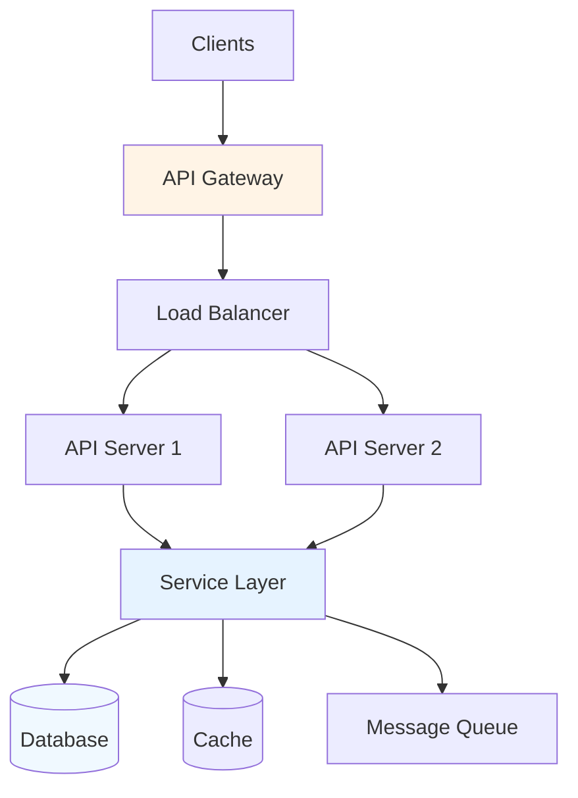

# API Service Analysis Report

**Project:** {{PROJECT_NAME}}
**Analysis Date:** {{DATE}}
**Repository:** {{REPO_URL}}

---

## Executive Summary

{{PROJECT_NAME}} is a {{TYPE}} API service built with {{FRAMEWORK}}. It provides {{API_CAPABILITIES}} for {{TARGET_USERS}}.

**Key Highlights:**
- **API Style:** {{REST_GRAPHQL}}
- **Architecture:** {{ARCHITECTURE_PATTERN}}
- **Primary Database:** {{DATABASE}}
- **Authentication:** {{AUTH_METHOD}}

---

## Overview

### Purpose

{{PURPOSE_PARAGRAPH}}

### API Capabilities

{{CAPABILITIES_LIST}}

### Technology Stack

- **Runtime:** {{RUNTIME}}
- **Framework:** {{FRAMEWORK}}
- **Database:** {{DATABASE}}
- **Cache:** {{CACHE_LAYER}}
- **Message Queue:** {{MESSAGE_QUEUE}}
- **Authentication:** {{AUTH_METHOD}}

---

## Architecture

### System Architecture



### API Architecture

**Pattern:** {{ARCHITECTURE_PATTERN}}

**Layers:**
```
api/
├── controllers/     # Request handlers
├── services/        # Business logic
├── repositories/    # Data access
├── models/          # Data models
├── middleware/      # Request processing
├── validators/      # Input validation
└── routes/          # Route definitions
```

---

## API Documentation

### Base URL

**Development:** `{{DEV_BASE_URL}}`
**Production:** `{{PROD_BASE_URL}}`
**Version:** `{{API_VERSION}}`

### Authentication

All endpoints require authentication unless noted.

**Method:** {{AUTH_METHOD}}

**Example:**
```bash
curl -H "Authorization: Bearer {{TOKEN}}" \
  {{BASE_URL}}/endpoint
```

---

## Endpoints

### Resource Endpoints

#### GET /api/{{RESOURCE}}

**Description:** {{DESCRIPTION}}

**Authentication:** {{REQUIRED_OPTIONAL}}

**Query Parameters:**
| Parameter | Type | Required | Default | Description |
|-----------|------|----------|---------|-------------|
| {{PARAM_1}} | {{TYPE}} | {{REQ}} | {{DEFAULT}} | {{DESC}} |
| {{PARAM_2}} | {{TYPE}} | {{REQ}} | {{DEFAULT}} | {{DESC}} |

**Response (200 OK):**
```json
{
  "data": [
    {
      "id": "{{ID}}",
      "{{FIELD_1}}": "{{VALUE_1}}",
      "{{FIELD_2}}": "{{VALUE_2}}",
      "created_at": "{{TIMESTAMP}}",
      "updated_at": "{{TIMESTAMP}}"
    }
  ],
  "meta": {
    "page": {{PAGE}},
    "per_page": {{PER_PAGE}},
    "total": {{TOTAL}},
    "total_pages": {{TOTAL_PAGES}}
  }
}
```

**Response (404 Not Found):**
```json
{
  "error": {
    "code": "NOT_FOUND",
    "message": "Resource not found"
  }
}
```

#### POST /api/{{RESOURCE}}

**Description:** {{DESCRIPTION}}

**Request Body:**
```json
{
  "{{FIELD_1}}": "{{VALUE_1}}",
  "{{FIELD_2}}": "{{VALUE_2}}",
  "{{FIELD_3}}": "{{VALUE_3}}"
}
```

**Validation Rules:**
- {{FIELD_1}}: {{VALIDATION_RULES}}
- {{FIELD_2}}: {{VALIDATION_RULES}}

**Response (201 Created):**
```json
{
  "data": {
    "id": "{{NEW_ID}}",
    "{{FIELD_1}}": "{{VALUE_1}}",
    "{{FIELD_2}}": "{{VALUE_2}}",
    "created_at": "{{TIMESTAMP}}"
  }
}
```

**Response (400 Bad Request):**
```json
{
  "error": {
    "code": "VALIDATION_ERROR",
    "message": "Invalid input",
    "details": {
      "{{FIELD_1}}": ["{{ERROR_1}}", "{{ERROR_2}}"]
    }
  }
}
```

#### PUT /api/{{RESOURCE}}/{{ID}}

**Description:** Update {{RESOURCE}}

**Request Body:** Same as POST

**Response (200 OK):**
```json
{
  "data": {
    "id": "{{ID}}",
    "{{FIELD_1}}": "{{UPDATED_VALUE}}",
    "updated_at": "{{TIMESTAMP}}"
  }
}
```

**Response (404 Not Found):**
```json
{
  "error": {
    "code": "NOT_FOUND",
    "message": "{{RESOURCE}} with ID {{ID}} not found"
  }
}
```

#### DELETE /api/{{RESOURCE}}/{{ID}}

**Description:** Delete {{RESOURCE}}

**Response (204 No Content):** Empty body

**Response (404 Not Found):** Standard error response

---

## Service Layer

### Core Services

#### {{SERVICE_NAME}}

**Purpose:** {{PURPOSE}}

**Location:** `{{SERVICE_PATH}}`

**Methods:**

**{{METHOD_NAME}}({{PARAMETERS}})**
```typescript
{{SIGNATURE}}
```
**Returns:** {{RETURN_TYPE}}
**Throws:** {{EXCEPTIONS}}

**Example:**
```typescript
{{EXAMPLE_USAGE}}
```

---

## Data Models

### {{MODEL_NAME}}

**Schema:**
```typescript
interface {{MODEL_NAME}} {
  id: string;
  {{FIELD_1}}: {{TYPE_1}};
  {{FIELD_2}}: {{TYPE_2}};
  {{FIELD_3}}: {{TYPE_3}};
  createdAt: Date;
  updatedAt: Date;
}
```

**Validation:**
- {{FIELD_1}}: {{VALIDATION}}
- {{FIELD_2}}: {{VALIDATION}}

**Relationships:**
- {{RELATIONSHIP_1}}
- {{RELATIONSHIP_2}}

**Database Schema:**
```sql
{{SQL_SCHEMA}}
```

---

## Middleware

### Authentication Middleware

**Purpose:** Validate authentication tokens

**Implementation:**
```typescript
{{MIDDLEWARE_CODE}}
```

### Rate Limiting

**Endpoint limits:**
- {{ENDPOINT_TYPE}}: {{RATE_LIMIT}}

**Implementation:** {{RATE_LIMITING_METHOD}}

### Logging Middleware

**Logged events:**
- Request received
- Response sent
- Errors
- Performance metrics

---

## Error Handling

### Error Response Format

```json
{
  "error": {
    "code": "{{ERROR_CODE}}",
    "message": "{{MESSAGE}}",
    "details": {{DETAILS_OBJECT}},
    "request_id": "{{REQUEST_ID}}"
  }
}
```

### Common Error Codes

| Code | HTTP Status | Description |
|------|-------------|-------------|
| VALIDATION_ERROR | 400 | Invalid input data |
| UNAUTHORIZED | 401 | Missing or invalid token |
| FORBIDDEN | 403 | Insufficient permissions |
| NOT_FOUND | 404 | Resource not found |
| CONFLICT | 409 | Resource conflict |
| RATE_LIMIT_EXCEEDED | 429 | Too many requests |
| INTERNAL_ERROR | 500 | Server error |

---

## Testing

### Test Coverage

**Unit Tests:** {{UNIT_TEST_COVERAGE}}%
**Integration Tests:** {{INTEGRATION_TEST_COVERAGE}}%
**E2E Tests:** {{E2E_TEST_COVERAGE}}%

### Running Tests

```bash
# All tests
npm test

# Unit tests
npm run test:unit

# Integration tests
npm run test:integration

# With coverage
npm run test:coverage
```

---

## Deployment

### Environment Variables

```bash
# Server
NODE_ENV=production
PORT=3000
API_VERSION=v1

# Database
DATABASE_URL={{DATABASE_URL}}
REDIS_URL={{REDIS_URL}}

# Authentication
JWT_SECRET={{JWT_SECRET}}
JWT_EXPIRES_IN={{EXPIRY}}

# External Services
EXTERNAL_API_KEY={{API_KEY}}
```

### Docker Deployment

```dockerfile
{{DOCKERFILE_CONTENT}}
```

**Build and Run:**
```bash
docker build -t {{APP_NAME}} .
docker run -p 3000:3000 \
  -e DATABASE_URL=${DATABASE_URL} \
  {{APP_NAME}}
```

### Cloud Deployment

**AWS:** {{AWS_DEPLOYMENT_STEPS}}

**Google Cloud:** {{GCP_DEPLOYMENT_STEPS}}

**Azure:** {{AZURE_DEPLOYMENT_STEPS}}

---

## Performance

### Optimization Strategies

- {{OPTIMIZATION_1}}
- {{OPTIMIZATION_2}}
- {{OPTIMIZATION_3}}

### Benchmarks

**Throughput:** {{THROUGHPUT_METRIC}}

**Latency:**
- P50: {{P50_LATENCY}}
- P95: {{P95_LATENCY}}
- P99: {{P99_LATENCY}}

**Concurrent Users:** {{CONCURRENT_USERS}}

---

## Monitoring

### Metrics

**Request Metrics:**
- Request rate
- Response time
- Error rate

**Business Metrics:**
- {{BUSINESS_METRIC_1}}
- {{BUSINESS_METRIC_2}}

### Logging

**Log Levels:**
- ERROR: Errors and exceptions
- WARN: Warning conditions
- INFO: Informational messages
- DEBUG: Debugging information

**Log Format:**
```json
{
  "timestamp": "{{TIMESTAMP}}",
  "level": "{{LEVEL}}",
  "message": "{{MESSAGE}}",
  "context": {{CONTEXT}},
  "request_id": "{{REQUEST_ID}}"
}
```

---

## Troubleshooting

### Common Issues

**Issue:** High latency
**Diagnosis:**
```bash
# Check slow queries
npm run analyze:performance

# Check database connections
npm run check:db-pool
```

**Solution:** {{SOLUTION}}

**Issue:** Database connection pool exhausted
**Diagnosis:**
```bash
# Check pool status
npm run check:pool-status
```

**Solution:** {{SOLUTION}}

---

## Security

### Security Measures

- {{SECURITY_MEASURE_1}}
- {{SECURITY_MEASURE_2}}
- {{SECURITY_MEASURE_3}}

### Rate Limiting

**Default Limits:**
- Authenticated requests: {{AUTH_LIMIT}}
- Unauthenticated requests: {{UNAUTH_LIMIT}}

### CORS Configuration

**Allowed Origins:** {{ALLOWED_ORIGINS}}

**Allowed Methods:** {{ALLOWED_METHODS}}

**Allowed Headers:** {{ALLOWED_HEADERS}}

---

*Generated by DeepWiki Analysis*
