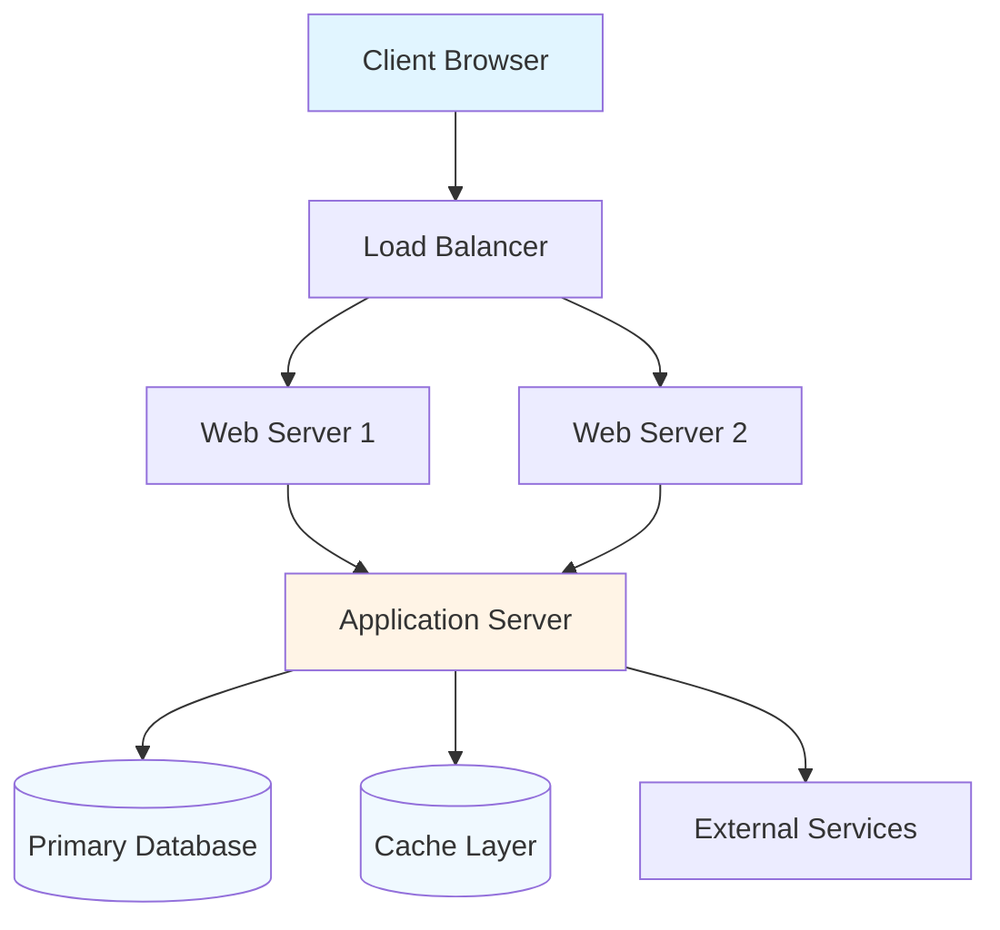
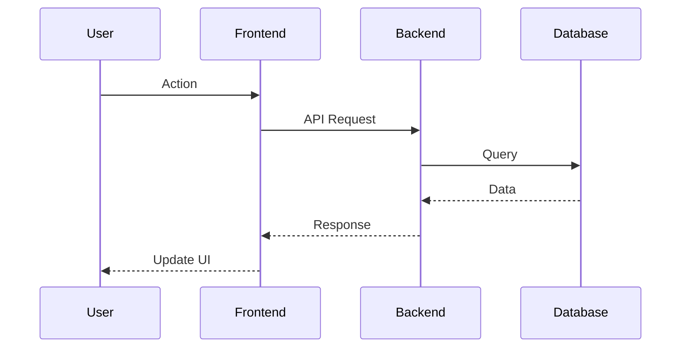

# Web Application Analysis Report

**Project:** {{PROJECT_NAME}}
**Analysis Date:** {{DATE}}
**Repository:** {{REPO_URL}}

---

## Executive Summary

{{PROJECT_NAME}} is a {{TYPE}} web application built with {{FRAMEWORK}}. It provides {{MAIN_FEATURES}} for {{TARGET_USERS}}.

**Key Highlights:**
- **Architecture:** {{ARCHITECTURE_PATTERN}}
- **Tech Stack:** {{TECH_STACK_SUMMARY}}
- **Scale:** {{SCALE_METRICS}}

---

## Project Overview

### Purpose and Goals

{{PURPOSE_PARAGRAPH}}

### Key Features

{{FEATURE_LIST}}

### Technology Stack

**Frontend:**
- {{FRONTEND_FRAMEWORK}}
- {{STATE_MANAGEMENT}}
- {{STYLING}}
- {{BUILD_TOOLS}}

**Backend:**
- {{BACKEND_FRAMEWORK}}
- {{API_LAYER}}
- {{AUTHENTICATION}}
- {{SERVER}}

**Database:**
- {{PRIMARY_DB}}
- {{CACHE_LAYER}}
- {{SEARCH_ENGINE}}

**Infrastructure:**
- {{HOSTING}}
- {{CI_CD}}
- {{MONITORING}}

---

## Architecture

### System Architecture



### Frontend Architecture

**Application Structure:**
```
src/
├── components/       # Reusable UI components
├── pages/           # Page components
├── hooks/           # Custom React hooks
├── services/        # API clients
├── store/           # State management
├── utils/           # Helper functions
└── types/           # TypeScript types
```

**Routing:**
- {{ROUTING_STRATEGY}}
- {{ROUTE_PROTECTION}}
- {{LAZY_LOADING}}

**State Management:**
- {{STATE_PATTERN}}
- {{DATA_FLOW}}
- {{PERSISTENCE}}

### Backend Architecture

**API Design:**
- {{API_STYLE}} (REST/GraphQL)
- Base URL: `{{API_BASE_URL}}`
- Authentication: {{AUTH_METHOD}}
- Rate limiting: {{RATE_LIMITING}}

**Service Layer:**
```
api/
├── controllers/     # Request handlers
├── services/        # Business logic
├── models/          # Data models
├── middleware/      # Express middleware
├── routes/          # Route definitions
└── validators/      # Input validation
```

**Business Logic:**
- {{SERVICE_ORGANIZATION}}
- {{KEY_SERVICES}}
- {{INTEGRATION_POINTS}}

### Data Architecture

**Database Schema:**
```
{{DB_SCHEMA_OVERVIEW}}
```

**Key Entities:**
- {{ENTITY_1}}: {{DESCRIPTION}}
- {{ENTITY_2}}: {{DESCRIPTION}}
- {{ENTITY_3}}: {{DESCRIPTION}}

**Relationships:**
```mermaid
erDiagram
    {{ENTITY_1}} {
        string id PK
        {{FIELDS}}
    }
    {{ENTITY_2}} {
        string id PK
        {{FIELDS}}
    }
    {{ENTITY_1}} ||--o{ {{ENTITY_2}} : "relationship"
```

---

## Component Analysis

### Frontend Components

**Core Components:**

#### {{COMPONENT_1}}
**Purpose:** {{PURPOSE}}
**Location:** `{{PATH}}`
**Props:** {{PROPS_LIST}}
**State:** {{STATE_MANAGEMENT}}
**Usage:** {{USAGE_EXAMPLE}}

#### {{COMPONENT_2}}
**Purpose:** {{PURPOSE}}
**Location:** `{{PATH}}`

### Backend Services

#### {{SERVICE_1}}
**Purpose:** {{PURPOSE}}
**Location:** `{{PATH}}`
**Methods:**
- `{{METHOD_1}}`: {{DESCRIPTION}}
- `{{METHOD_2}}`: {{DESCRIPTION}}

**Dependencies:**
- Internal: {{INTERNAL_DEPS}}
- External: {{EXTERNAL_DEPS}}

---

## Key Features

### Feature 1: {{FEATURE_NAME}}

**Description:** {{DESCRIPTION}}

**Implementation:**
- Frontend: {{FRONTEND_IMPL}}
- Backend: {{BACKEND_IMPL}}
- Database: {{DB_IMPL}}

**User Flow:**


### Feature 2: {{FEATURE_NAME}}

**Description:** {{DESCRIPTION}}

---

## API Documentation

### Authentication

**Endpoint:** `{{AUTH_ENDPOINT}}`

**Request:**
```json
{
  "email": "user@example.com",
  "password": "password"
}
```

**Response:**
```json
{
  "token": "jwt_token",
  "user": {
    "id": "user_id",
    "email": "user@example.com",
    "name": "User Name"
  }
}
```

### Main Endpoints

#### GET /api/resource

**Description:** {{DESCRIPTION}}

**Authentication:** {{REQUIRED}}

**Query Parameters:**
| Param | Type | Required | Description |
|-------|------|----------|-------------|
| {{PARAM_1}} | {{TYPE}} | {{REQUIRED}} | {{DESCRIPTION}} |
| {{PARAM_2}} | {{TYPE}} | {{REQUIRED}} | {{DESCRIPTION}} |

**Response:**
```json
{
  "data": [...],
  "meta": {
    "page": 1,
    "per_page": 20,
    "total": 100
  }
}
```

#### POST /api/resource

**Request Body:**
```json
{
  "field1": "value1",
  "field2": "value2"
}
```

**Response (201):**
```json
{
  "id": "new_id",
  "field1": "value1",
  "field2": "value2",
  "created_at": "2024-01-01T00:00:00Z"
}
```

---

## Setup and Deployment

### Local Development

**Prerequisites:**
- {{PREREQUISITE_1}}
- {{PREREQUISITE_2}}

**Installation:**
```bash
# Clone repository
git clone {{REPO_URL}}
cd {{PROJECT_NAME}}

# Install dependencies
npm install

# Setup environment
cp .env.example .env
# Edit .env with your configuration

# Setup database
npm run db:setup

# Start development
npm run dev
```

**Access:**
- Frontend: http://localhost:{{FRONTEND_PORT}}
- Backend API: http://localhost:{{API_PORT}}
- Database: {{DB_CONNECTION_STRING}}

### Production Deployment

**Build:**
```bash
npm run build
```

**Deployment:**
```bash
# Environment variables
NODE_ENV=production
{{PRODUCTION_VARS}}

# Start
npm run start
```

**Docker:**
```bash
docker build -t {{APP_NAME}} .
docker run -p {{PORT}}:{{PORT}} {{APP_NAME}}
```

---

## Development Guide

### Project Structure

```
{{PROJECT_STRUCTURE_TREE}}
```

### Adding a New Feature

**Frontend:**
1. Create component in `src/components/`
2. Add route in `src/routes/`
3. Update state management if needed
4. Add tests in `src/components/__tests__/`

**Backend:**
1. Create service in `api/services/`
2. Add controller in `api/controllers/`
3. Define routes in `api/routes/`
4. Add tests in `tests/services/`

### Testing

**Unit Tests:**
```bash
npm run test:unit
```

**Integration Tests:**
```bash
npm run test:integration
```

**E2E Tests:**
```bash
npm run test:e2e
```

**Coverage:**
```bash
npm run test:coverage
```

---

## Performance and Scalability

### Performance Optimizations

- {{OPTIMIZATION_1}}
- {{OPTIMIZATION_2}}
- {{OPTIMIZATION_3}}

### Scalability Considerations

- **Horizontal Scaling:** {{SCALING_STRATEGY}}
- **Caching Strategy:** {{CACHE_STRATEGY}}
- **Database Optimization:** {{DB_OPTIMIZATION}}
- **Load Balancing:** {{LOAD_BALANCING}}

---

## Security

### Authentication & Authorization

- {{AUTH_METHOD}}
- {{SESSION_MANAGEMENT}}
- {{RBAC_IMPLEMENTATION}}

### Security Measures

- {{SECURITY_MEASURE_1}}
- {{SECURITY_MEASURE_2}}
- {{SECURITY_MEASURE_3}}

---

## Monitoring and Logging

**Logging:**
- {{LOGGING_FRAMEWORK}}
- {{LOG_LEVELS}}
- {{LOG_DESTINATION}}

**Monitoring:**
- {{MONITORING_TOOL}}
- {{METRICS_TRACKED}}
- {{ALERTING}}

---

## Troubleshooting

### Common Issues

**Issue:** {{ISSUE_TITLE}}
**Solution:** {{SOLUTION_STEPS}}

**Issue:** Port already in use
**Solution:**
```bash
# Find process
lsof -i :{{PORT}}

# Kill process
kill -9 {{PID}}

# Or use different port
PORT={{NEW_PORT}} npm run dev
```

---

## Dependencies

### Production Dependencies

{{DEPENDENCY_TABLE}}

### Development Dependencies

{{DEV_DEPENDENCY_TABLE}}

---

## Future Improvements

- {{IMPROVEMENT_1}}
- {{IMPROVEMENT_2}}
- {{IMPROVEMENT_3}}

---

*Generated by DeepWiki Analysis*
