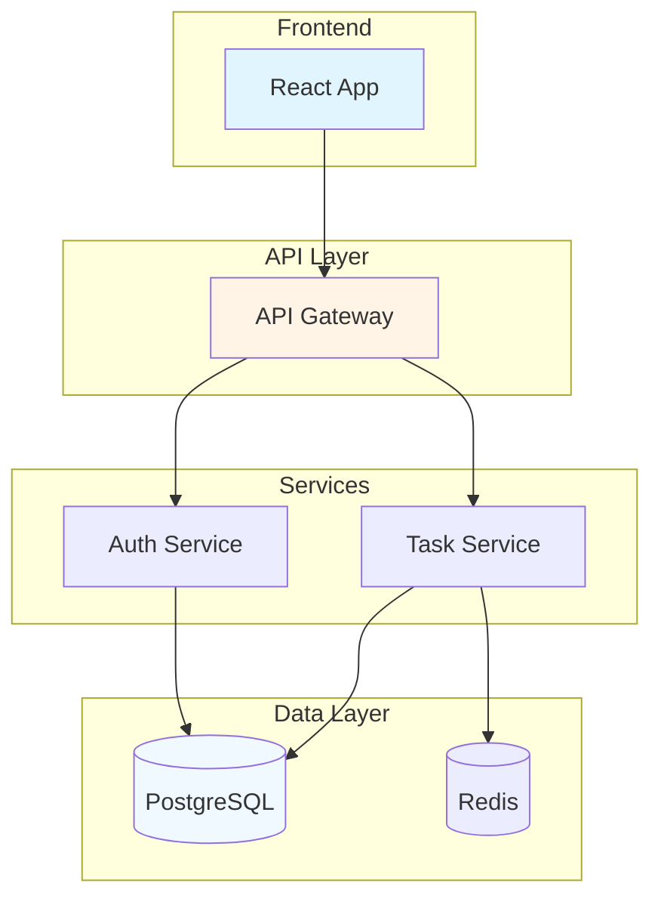
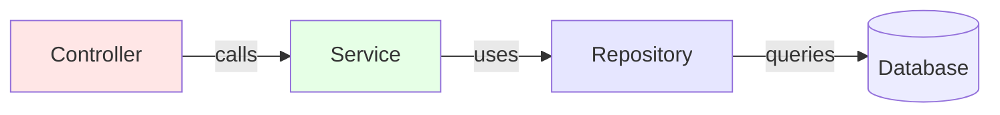
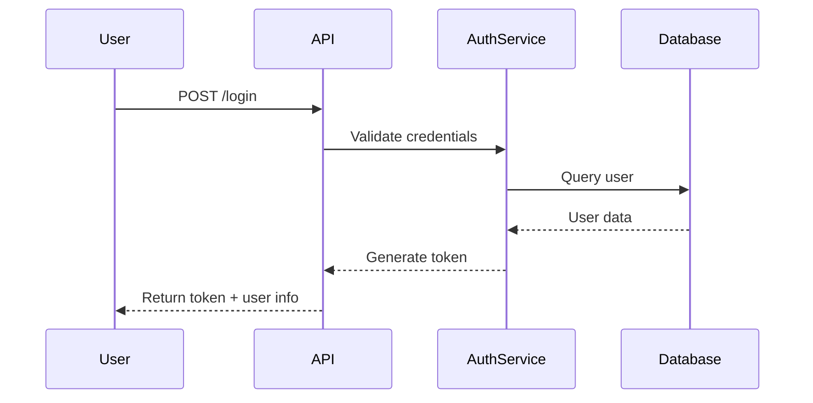

# Documentation Standards

Guidelines for writing high-quality project analysis reports.

## Writing Principles

### Clarity First

**Do:**
- Use simple, direct language
- Explain technical terms
- Provide context
- Use examples

**Don't:**
- Use jargon without explanation
- Assume prior knowledge
- Write vague descriptions
- Skip important details

### Structure and Organization

**Logical flow:**
```
1. What (overview)
2. Why (purpose)
3. How (architecture)
4. Details (components)
5. Usage (examples)
```

**Each section should:**
- Have a clear purpose
- Flow naturally from previous sections
- Prepare for following sections
- Stand alone if needed

### Audience Awareness

**Consider:**
- Developer peers
- New team members
- Non-technical stakeholders
- Future maintainers

**Adapt tone:**
- Technical details for developers
- High-level overview for stakeholders
- Examples for newcomers

## Document Structure

### Executive Summary

**Purpose:** Quick understanding of the project

**Length:** 2-3 paragraphs

**Content:**
```
Paragraph 1: What and Why
- Project name and type
- Problem it solves
- Target audience

Paragraph 2: How
- Technology stack (high-level)
- Architecture pattern
- Key features

Paragraph 3: Key Points
- Notable design decisions
- Important integrations
- Scale/complexity
```

**Example:**
```
ProjectX is a web-based task management application designed
for small to medium teams. It provides real-time collaboration,
project tracking, and reporting capabilities.

Built with React and Node.js, ProjectX uses a microservices
architecture with separate services for authentication, task
management, and notifications. The application follows a
clean architecture pattern with clear separation between
presentation, business logic, and data access layers.

Key features include real-time updates via WebSockets,
flexible project templates, and comprehensive reporting.
The system scales to handle thousands of concurrent users
and integrates with popular tools like Slack and GitHub.
```

### Architecture Section

**Purpose:** Explain system organization

**Content:**
1. **Architecture diagram** (Mermaid)
2. **Architecture pattern description**
3. **Layer/component explanation**
4. **Technology choices rationale**

**Example structure:**
```markdown
## Architecture

ProjectX uses a layered microservices architecture:

### Architecture Pattern
[Diagram]

### Components
- **Frontend:** React SPA with TypeScript
- **API Gateway:** Express.js middleware
- **Services:** Node.js microservices
- **Database:** PostgreSQL + Redis
- **Message Queue:** RabbitMQ

### Technology Rationale
- React: Component reusability and ecosystem
- Node.js: Full-stack JavaScript consistency
- Microservices: Independent scaling and deployment
- PostgreSQL: ACID compliance for transactions
```

### Component Documentation

**Purpose:** Explain each major component

**Template:**
```markdown
### ComponentName

**Purpose:** One sentence description

**Location:** `path/to/component`

**Responsibilities:**
- Responsibility 1
- Responsibility 2
- Responsibility 3

**Key Classes/Functions:**
- `ClassName1`: Description
- `ClassName2`: Description
- `functionName()`: Description

**Dependencies:**
- Internal: ComponentA, ComponentB
- External: LibraryX, LibraryY

**Example Usage:**
```python
code example
```
```

### API Documentation

**Purpose:** Document public interfaces

**Template:**
```markdown
### API Endpoint: GET /api/resource

**Description:** Retrieve a list of resources

**Authentication:** Required (Bearer token)

**Query Parameters:**
| Parameter | Type | Required | Description |
|-----------|------|----------|-------------|
| page | integer | No | Page number (default: 1) |
| limit | integer | No | Items per page (default: 20) |

**Response (200 OK):**
```json
{
  "data": [...],
  "pagination": {
    "page": 1,
    "total": 100
  }
}
```

**Error Responses:**
- 401: Unauthorized
- 403: Forbidden
- 500: Server Error

**Example:**
```bash
curl -H "Authorization: Bearer TOKEN" \
  https://api.example.com/resource?page=1&limit=20
```
```

### Setup Instructions

**Purpose:** Guide users through installation

**Template:**
```markdown
## Installation

### Prerequisites
- Node.js 18+ and npm
- Python 3.9+
- PostgreSQL 14+
- Redis 6+

### Step 1: Clone Repository
```bash
git clone https://github.com/user/project.git
cd project
```

### Step 2: Install Dependencies
```bash
npm install
pip install -r requirements.txt
```

### Step 3: Configure Environment
```bash
cp .env.example .env
# Edit .env with your configuration
```

### Step 4: Initialize Database
```bash
npm run db:migrate
npm run db:seed
```

### Step 5: Start Development Server
```bash
npm run dev
```

The application will be available at http://localhost:3000
```

## Diagram Guidelines

### System Architecture Diagrams

**Use:** graph TD (top-down)

**Best practices:**
- Maximum 10-15 nodes
- Group related components
- Use subgraphs for layers
- Label all connections
- Color-code by type

**Example:**


### Component Relationship Diagrams

**Use:** graph LR (left-right)

**Best practices:**
- Show data flow
- Indicate dependencies
- Label relationships
- Use arrows for direction

**Example:**


### Sequence Diagrams

**Use:** sequenceDiagram

**Best practices:**
- Show interaction flow
- Include error handling
- Label messages clearly
- Show time ordering

**Example:**


## Code Documentation

### Function Documentation

**Template:**
```python
def function_name(param1: Type, param2: Type) -> ReturnType:
    """
    Brief description of what the function does.

    Detailed explanation of the function's purpose,
    approach, and any important considerations.

    Args:
        param1: Description of param1
        param2: Description of param2

    Returns:
        Description of return value

    Raises:
        ValueError: If param1 is invalid
        ConnectionError: If database connection fails

    Example:
        >>> result = function_name("value1", "value2")
        >>> print(result)
        'output'
    """
    pass
```

### Class Documentation

**Template:**
```python
class ClassName:
    """
    Brief description of the class purpose.

    Detailed explanation of the class's responsibilities,
    usage patterns, and design considerations.

    Attributes:
        attr1 (Type): Description of attr1
        attr2 (Type): Description of attr2

    Example:
        >>> obj = ClassName()
        >>> obj.method()
        'result'
    """

    def __init__(self, param1: Type):
        """Initialize the class."""
        pass

    def method(self):
        """Public method description."""
        pass
```

## Formatting Guidelines

### Code Blocks

**Use syntax highlighting:**
````python
code here
````

````javascript
code here
````

### Tables

**For structured data:**
```markdown
| Column 1 | Column 2 | Column 3 |
|----------|----------|----------|
| Data 1   | Data 2   | Data 3   |
```

### Lists

**Use for:**
- Steps in process
- Features/capabilities
- Dependencies
- Examples

**Ordered lists for sequences:**
```markdown
1. First step
2. Second step
3. Third step
```

**Unordered lists for collections:**
```markdown
- Item 1
- Item 2
- Item 3
```

### Callouts

**For important notes:**
```markdown
> **Note:** This is an important note.
> **Warning:** Be careful with this.
> **Tip:** This might help you.
```

## Language and Tone

### Voice

**Use:** Second person ("you"), imperative mood

**Good:**
- "Install the dependencies"
- "Configure the environment"
- "Run the tests"

**Avoid:**
- "The user should install"
- "One must configure"
- "Tests are run"

### Consistency

**Maintain:**
- Terminology consistency
- Formatting consistency
- Capitalization consistency
- Code style consistency

### Technical Terms

**Guidelines:**
- Define on first use
- Use consistently
- Link to external docs if helpful
- Avoid unnecessary jargon

## Quality Standards

### Completeness

**Each section should:**
- Answer key questions
- Provide necessary context
- Include examples
- Link to related info

### Accuracy

**Verify:**
- Code examples work
- Commands are correct
- File paths exist
- Versions are current

### Relevance

**Include:**
- Essential information
- Common use cases
- Typical scenarios
- Edge cases (if important)

**Exclude:**
- Obvious details
- Rare edge cases
- Outdated information
- Opinion-based recommendations

## Review Checklist

### Content
- [ ] All major components documented
- [ ] Architecture explained clearly
- [ ] Setup instructions complete
- [ ] Examples provided
- [ ] API/interfaces documented

### Clarity
- [ ] Language is clear and concise
- [ ] Technical terms explained
- [ ] Examples easy to follow
- [ ] No ambiguous statements

### Accuracy
- [ ] Code examples tested
- [ ] File paths correct
- [ ] Commands verified
- [ ] Diagrams accurate

### Completeness
- [ ] Executive summary included
- [ ] All sections present
- [ ] No missing important details
- [ ] Links work

### Formatting
- [ ] Consistent formatting
- [ ] Proper code highlighting
- [ ] Diagrams render correctly
- [ ] Tables formatted properly

## Common Mistakes

### 1. Too Much Detail

**Problem:** Including every function/class

**Solution:** Focus on important parts, summarize others

### 2. Too Little Detail

**Problem:** Vague descriptions

**Solution:** Provide specific examples and explanations

### 3. Outdated Information

**Problem:** Documentation doesn't match code

**Solution:** Keep docs in sync with code changes

### 4. No Examples

**Problem:** Abstract explanations only

**Solution:** Include code examples for key concepts

### 5. Poor Organization

**Problem:** Information scattered

**Solution:** Use clear sections and logical flow

## Tips for Effective Documentation

1. **Start with overview:** Provide context before details
2. **Use diagrams:** Visuals help understanding
3. **Include examples:** Code samples clarify concepts
4. **Keep it current:** Update docs with code changes
5. **Get feedback:** Have others review your docs
6. **Be concise:** Respect reader's time
7. **Think audience:** Write for your readers
8. **Use templates:** Maintain consistency
9. **Proofread:** Check for errors and clarity
10. **Iterate:** Improve docs over time

Following these standards ensures clear, comprehensive, and useful project documentation.
